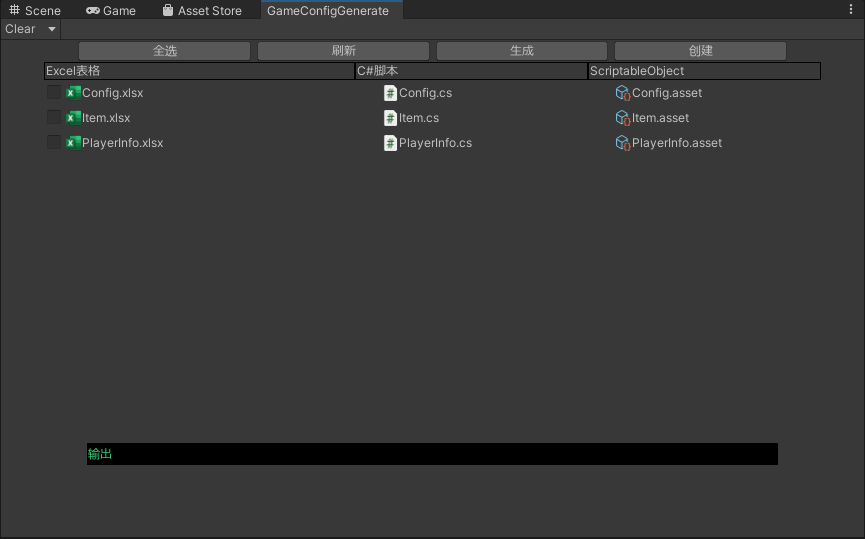

# ExcelToScriptableAuto
Unity support. ExcelToScriptableAuto. Need unity version 2020+

# Author

Author: chasinghope

E-mail： bobjiang1045@163.com

Twitter: @chasing1045

# What can it do

Automatically convert excel into scriptableobject. It's convenient for you to use it directly in the game
1. Excel for configuration file and planning
2. Data and logic decoupling
3. Automatic serialization to save your time

# How To Use It

1. In ToolBar   GameConfig/ExcelGenerateObj

2. Create and edit Excel files
3. Generate C# codes
4. Generate scriptable assets.
5. **GameConfigSO.asset**  is your need.



Tips:

You Can Set path In **ExcelToolConfig.cs**

```c#
public class ExcelToolConfig
{
    public const string ExcelPath = "DataConfigToScriptable/Generate/Excel/";
    public const string SOPath = "DataConfigToScriptable/Generate/SO/";
    public const string ScriptPath = "DataConfigToScriptable/Generate/Script/";
}
```

